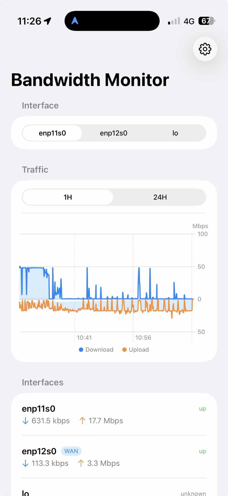
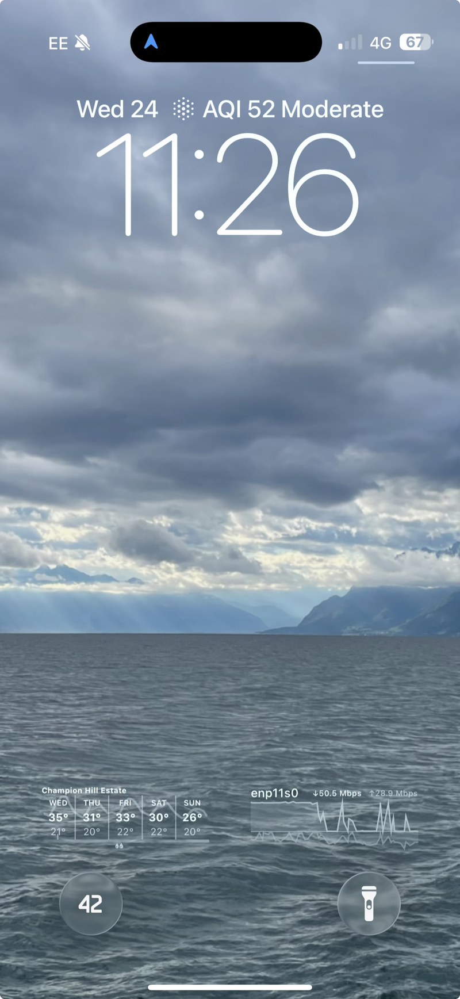

# Bandwidth Monitor (iOS)

SwiftUI client for [awlx/bandwidth-monitor](https://github.com/awlx/bandwidth-monitor), showing
live interface rates plus 1h / 24h traffic graphs, a Lock Screen widget, and a live
Lock Screen / Dynamic Island view (Live Activity).

## Screenshots

<table>
  <tr>
    <th>App (Traffic)</th>
    <th>Lock Screen widget</th>
  </tr>
  <tr>
    <td></td>
    <td></td>
  </tr>
</table>

The chart mirrors around zero — download above the line, upload below — in Mbps (decimal bits).
The Lock Screen widget shows the same shape as a monochrome sparkline for the selected interface.

## Requirements

- Xcode 16+ (iOS 17 deployment target, uses Swift Charts)
- A running bandwidth-monitor instance reachable on your network (e.g. `http://192.168.1.1:8080`)

## Getting started

```bash
open BandwidthMonitor.xcodeproj
```

Build and run on a simulator or device, then open the gear icon and set your server's address.

The project file is generated by [xcodegen](https://github.com/yonaskolb/XcodeGen) from `project.yml`.
If you add/remove source files or change build settings, edit `project.yml` and regenerate:

```bash
xcodegen generate
```

## Releasing

The version lives in one place — `MARKETING_VERSION` and `CURRENT_PROJECT_VERSION` in
`project.yml`; both Info.plists reference those build settings. `scripts/release.sh` automates the
bump → regenerate → commit → tag → GitHub Release flow:

```bash
scripts/release.sh 0.9.1     # cut a release: set marketing version, bump build, tag v0.9.1, publish
scripts/release.sh bump-build # just bump the build number for a new TestFlight/App Store upload
scripts/release.sh 1.0.0 --no-build   # skip the compile check
```

It refuses to run on a dirty tree or an existing tag, and compile-checks before tagging (unless
`--no-build`). Needs `xcodegen` and an authenticated `gh`.

## How it talks to the server

It polls two endpoints on the Go server (see that repo's README "API Endpoints" section for the
full list):

- `GET /api/interfaces` — current per-interface rates, polled every ~2s for the live list.
- `GET /api/interfaces/history` — up to 24h of per-second `{t, rx, tx}` samples per interface,
  polled every ~16s. The 1H/24H toggle just filters this client-side and downsamples to a few
  hundred points for the chart — no separate "1h" endpoint exists server-side.

Plain HTTP to a LAN router IP requires `NSAllowsArbitraryLoads` (set in `project.yml`) and
triggers iOS's local-network permission prompt (`NSLocalNetworkUsageDescription`).

## Structure

```
BandwidthMonitor/
  App/             App entry point
  Services/        LiveActivityController (start/update/end the Live Activity)
  Shared/          Code shared with the widget extension:
    Models/        Decodable types mirroring the Go server's JSON
    Networking/    APIClient (URLSession-based)
    Settings/      App Group accessors + widget snapshot cache
    Utilities/     BitRateFormatter (Mbps/kbps)
    LiveActivity/  ActivityKit attributes + content state
  ViewModels/      Polling + chart-windowing logic
  Views/           SwiftUI screens
BandwidthMonitorWidget/   WidgetKit extension: Lock Screen sparkline + Live Activity UI
```

## Lock Screen widget

`BandwidthMonitorWidget` is a WidgetKit extension (`accessoryRectangular` family) showing a
monochrome sparkline for one interface: RX plotted above the zero line, TX plotted below it, no
color, no axes. It reads the server URL and selected interface from an App Group
(`group.com.evilforbeginners.BandwidthMonitor`, shared via `BandwidthMonitor/Shared/Settings/AppGroup.swift`)
so it can fetch data on its own, independent of the host app.

Notes:

- In Xcode, you'll likely need to set your Team on both targets and confirm the App Groups
  capability is enabled for `group.com.evilforbeginners.BandwidthMonitor` on each (Signing &
  Capabilities tab) before it'll build/run on device.
- Widget timelines are refreshed by the OS on its own schedule (here requested every ~15 min) —
  this is **not** a live view. The graph reflects whatever the server returned at the last refresh,
  not a real-time sliding window.
- The app calls `WidgetCenter.shared.reloadTimelines` when you change the server URL or selected
  interface, so the widget updates promptly after a settings change even though it's otherwise on
  a slow OS-driven cadence.

## Live Activity (live view)

The **"Go Live"** toolbar button starts an [ActivityKit](https://developer.apple.com/documentation/activitykit)
Live Activity that shows the selected interface on the **Lock Screen and Dynamic Island**: current
↓/↑ rates in Mbps and the same mirrored sparkline as the app. The **latest sample is marked** with
a dashed "now" rule on the x-axis plus emphasised dots on the latest RX/TX points; a synthetic
"now" sample carrying the live rate is appended so that marker tracks the current rate rather than
the (up to ~16s old) tail of the history series.

- Pieces: `BandwidthActivityAttributes` (Shared/LiveActivity), `BandwidthLiveActivity` (the widget
  extension's Lock Screen + Dynamic Island UI), `LiveActivityController` (Services). The app target
  sets `NSSupportsLiveActivities`.
- Updates are **local** — they only land while the app is running (foreground, briefly background).
  When the app is fully suspended the activity stays pinned showing the last values but stops
  ticking. Keeping it live in your pocket would need **ActivityKit push updates (APNs)** driven from
  the server — the planned follow-up.

## Not yet implemented

- **Live Activity push (APNs):** server-driven updates so the Lock Screen view keeps ticking while
  the app is suspended.
- The Go server also exposes DNS, WiFi, NAT, speed test, and debug data (`/api/dns`, `/api/wifi`,
  `/api/conntrack`, etc.) that could be added as further tabs or widgets following the same pattern.
